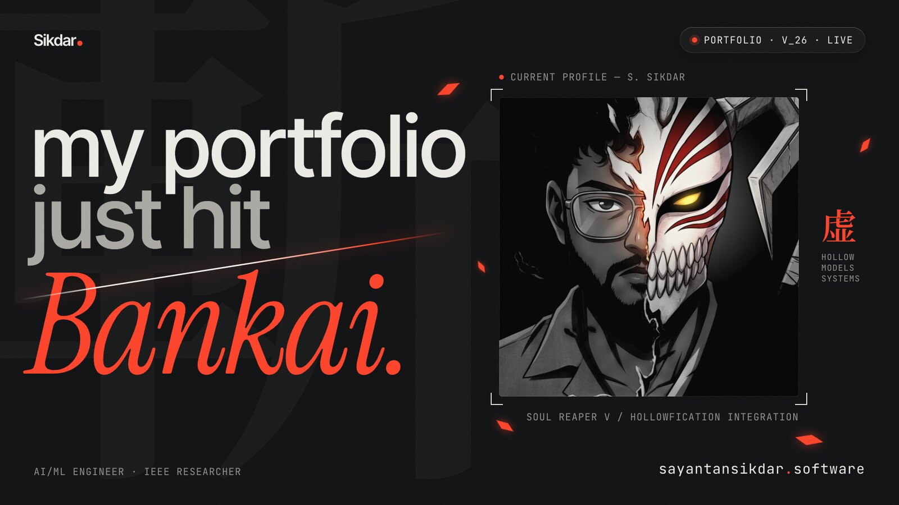

<!-- Typing animation -->

  
  
  

  
  
  

<!-- Numbers that come straight from the repos below -->
<table align="center">
  <tr>
    <td align="center" width="160">
      
       <b>Projects shipped</b>
    </td>
    <td align="center" width="160">
      
       <b>Tests in one CI</b>
    </td>
    <td align="center" width="160">
      
       <b>Reconciled to the cent</b>
    </td>
    <td align="center" width="160">
      
       <b>IEEE paper</b>
    </td>
  </tr>
</table>

## 👋 yo, i'm Sayantan

> 🎓 M.Tech (IT) at **Netaji Subhas University of Technology** · B.Tech CSE (AI/ML)
>
> 🤖 I take AI ideas from *"this could work"* to *"this is running and people use it"* — LLM fine-tuning, durable agents, lakehouse pipelines and software with real test coverage
>
> 🧭 I like sitting close to the problem: scoping with the people who have it, shipping the fix, then explaining the numbers
>
> 📄 IEEE-published · currently vibing toward **AI SDE / Forward Deployed Engineer** roles · powered by ☕

## ⚡ Toolkit

<b>GenAI & ML</b> 
  
  
  
  
  
  
  
  
  

<b>Engineering</b> 
  
  
  
  
  
  
  
  
  
  

<b>Testing & shipping</b> 
  
  
  
  
  
  
  

<b>Cloud & data</b> 
  
  
  
  
  
  

## 🚀 Featured work

<b>🏛️ NovaCart — Microsoft Fabric medallion pipeline</b> · <i>data engineering, team of 5</i>

 

Finance at a 5-country retailer had conflicting revenue numbers, and late corrections could overwrite newer orders. Built a bronze → silver → gold lakehouse with guarded Delta MERGEs, SCD Type 2 and as-of FX.

| Result | |
|---|---|
| Order versions → orders | **2,963 → 945** |
| Stale updates blocked | **10** |
| Revenue matched to an independent check | **$295,585.57, to the cent** |
| Rows changed on re-run | **0** |
| Automated tests | **224** |

`Microsoft Fabric` `PySpark` `Spark SQL` `Delta Lake` `Data Pipelines` · [Repository](https://github.com/sayantansikdar/novacart-medallion-pipeline)

<b>📞 SmartDialer — outbound-dialer simulator with a safety engine</b> · <i>systems & QA</i>

 

A predictive dialer that over-dials must never ring a do-not-call number or leak capacity in an outage. Every dial passes **13 ordered, explainable safety rules**; seeded simulations are proven deterministic with a SHA-256 digest.

| Result | |
|---|---|
| Vitest tests / Cypress–Cucumber BDD scenarios | **529 / 35** |
| Do-not-call breaches | **0** |
| Contact reservation at 1,500 agents | **40× faster** (722 → 17.9 µs) |

`TypeScript` `Fastify` `React` `SQLite` `Vitest` `Cypress` `GitHub Actions` · [Repository](https://github.com/sayantansikdar/smartdialer) · [Live demo](https://sayantansikdar.github.io/smartdialer/)

<b>🤖 Order Supervisor — long-running AI agent on Temporal</b> · <i>agentic AI</i>

 

One durable Temporal workflow per order; the agent wakes on 3 triggers (start, signal, timer), a classifier gates events by urgency, and it acts through 6 tools with a rolling memory — sleeping on durable timers instead of polling. Runs end to end with no API key via a deterministic mock policy.

`Python` `Temporal` `FastAPI` `PostgreSQL` `Claude API` `Next.js` · [Repository](https://github.com/sayantansikdar/order-supervisor)

<b>🧠 EmpaChat — empathetic response AI</b> · <i>LLM fine-tuning</i>

 

| Result | |
|---|---|
| Trainable params (GPT-2 XL + LoRA) | **8.4M of 1.56B — 99.4% fewer** |
| Emotion classification accuracy | **~89%** on 58K GoEmotions comments |
| GPU inference latency | **~150 ms** |
| Simulated A/B preference gain | **35%** |

`PyTorch` `Hugging Face` `PEFT (LoRA / QLoRA)` `FastAPI` `Gradio` `Docker` · [Repository](https://github.com/sayantansikdar/empathetic-ai)

<b>📈 Basket Trading Optimization Framework</b> · <i>quant ML</i>

 

Benchmarked 6 optimizers for out-of-sample cointegration basket weights after 0.1% costs.

| Result | |
|---|---|
| Best Sharpe ratio (CVFS-CMA-ES) | **3.851** — 9× standard CMA-ES |
| Max drawdown | **−3.99%** |
| Best total return (Bayesian optimization) | **63.76%** |

`Python` `CMA-ES` `scikit-optimize` `Statsmodels` `Pandas` · [Repository](https://github.com/sayantansikdar/Advanced-Basket-Trading-Optimization-Framework)

<b>🍽️ Morsaab's — restaurant platform for a real client</b> · <i>freelance full stack</i>

 

Next.js 15 platform with a 9-category menu on Neon Postgres + Drizzle, Stripe Checkout with signed webhooks, a Clerk-gated admin CRM and Datadog RUM — **9.8k lines in under 40 hours**, live on Vercel.

`Next.js` `TypeScript` `PostgreSQL` `Stripe` `Clerk` · [Repository](https://github.com/sayantansikdar/morsaabs) · [Live](https://morsaabs.vercel.app)

<b>🍎 Fruit grading with deep learning</b> · <i>computer vision, IEEE published</i>

 

AlexNet / ResNet v2 framework for real-time, non-destructive grading — **99%** accuracy on 2.2K images and **98.33%** (0.9752 F1) on 15.5K images.

`TensorFlow` `Keras` `OpenCV` · [Repository](https://github.com/sayantansikdar/fruit-grading-and-classification) · [IEEE paper](https://ieeexplore.ieee.org/document/10649049)

<b>📚 Bookie — end-to-end MLOps recommender</b> · <i>MLOps</i>

 

One `docker compose up` runs 6 services: a 4-stage Airflow DAG trains SVD collaborative filtering, with DVC, MLflow, FastAPI, a React front end and Prometheus/Grafana monitoring.

`Airflow` `DVC` `MLflow` `FastAPI` `React` `Docker` · [Repository](https://github.com/sayantansikdar/bookie)

## 💼 Experience

| Period | Role | Where | Highlights |
|---|---|---|---|
| Feb 2025 – May 2025 | Freelance Full Stack Developer | Self-employed | Shipped Morsaab's platform — Stripe, admin CRM — in under 40 hours |
| Mar 2024 – Apr 2024 | Architect-Machine Learning Trainee | WBSEDCL | YOLO v5/v7/v9-e meter reading: 99% accuracy, 93% mAP, 95% fewer errors, 500+ hours saved a year |
| Sep 2023 – Mar 2024 | Artificial Intelligence Intern | NIELIT Kolkata | Fruit-grading DNN, 99% accuracy — published at IEEE |

## 📊 GitHub stats

  
  
  

## 📄 Research

**Deep Neural Network Based Yield Phenotyping Framework: Fruit Grading and Classification** — *IEEE*
Cassandra Chang, Sayantan Sikdar · [Read on IEEE Xplore](https://ieeexplore.ieee.org/document/10649049)

## 🏅 Certifications & achievements

  
  
  
  
  
  

## 🎓 Education

| Degree | Institution | CGPA | Years |
|---|---|---|---|
| M.Tech (IT) | Netaji Subhas University of Technology | 7.11 | 2025 – 2027 |
| B.Tech (CSE – AI & ML) | Haldia Institute of Technology | 8.65 | 2020 – 2024 |

---

**building something with AI and need someone who can code it, ship it and explain it? let's talk.**

here to create, innovate and caffeinate ☕

